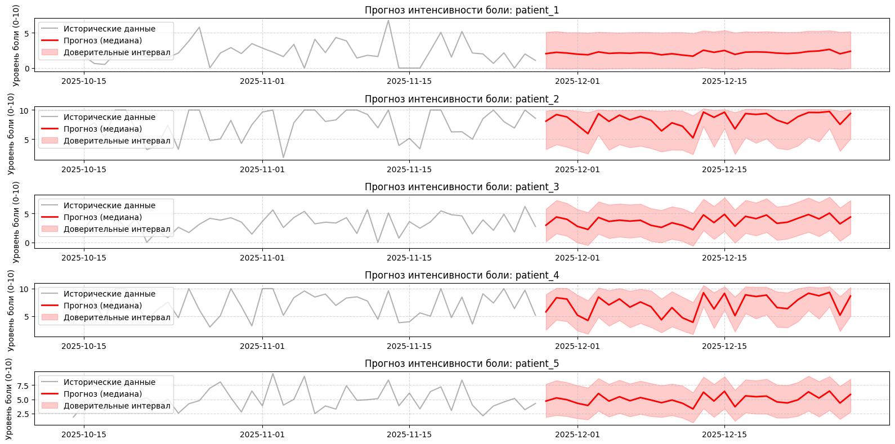

# Мониторинг влияния солнечной активности на самочувствие человека

**Проектная практика: Мониторинг экосистемы через IT-решения**

В рамках данного проекта человек рассматривается как биологический объект, являющийся неотъемлемой частью глобальной экосистемы Земли. Мониторинг экосистемы в данной работе расширяется до анализа **космической погоды** — внешнего фактора окружающей среды, который оказывает прямое влияние на физиологическое состояние живых организмов.

Использование IT-решений позволяет связать динамику факторов внешней среды с биометрическими показателями человека, реализуя концепцию превентивного цифрового мониторинга здоровья в рамках экосистемы.

## 📝 Тема работы
**Корреляция факторов солнечной активности и субъективных маркеров самочувствия человека на примере головной боли.**

## ✨ Введение
Целью работы является выявление закономерностей между солнечной активностью и состоянием здоровья. В основе лежит анализ временных рядов и разработка прототипа для прогнозирования динамики самочувствия с использованием модели Chronos-2.

## 🎯 Решение бизнес-задачи
Проект автоматизирует процесс мониторинга, что позволяет:
* **Индивидуальным пользователям** заблаговременно снижать физическую нагрузку в дни прогнозируемых аномалий
* **Медицинским исследователям** получать визуализированную статистику корреляции состояния пациентов с внешними экологическими факторами

### Ключевые показатели мониторинга экосистемы
| Индекс | Описание | Роль в системе |
| :--- | :--- | :--- |
| **F10.7** | Solar Radio Flux | Индекс потока радиоизлучения Солнца |
| **Kp-index** | Planetary K-index | Показатель возмущения магнитного поля Земли |
| **SSN** | Sunspot Number | Количество солнечных пятен |
| **X-Ray Flux** | Solar Flares | Интенсивность рентгеновского излучения |
| **Target** | Pain Level | Субъективная интенсивность головной боли (0–10)

## 🛠️ Технологический стек
Проект представляет собой программный комплекс для предиктивного анализа влияния факторов экосистемы на биометрические показатели.

* **Ядро системы**: Transformer [Amazon Chronos-2-base](https://huggingface.co/amazon/chronos-2) в формате zero-shot forecasting (без дообучения).
* **Стек**: Python 3.10+, библиотеки `chronos-forecasting`, `pandas`, `numpy`, `matplotlib`, `datetime`.
* **Валидация**: Алгоритм протестирован на синтетически сгенерированных профилях испытуемых с заданными параметрами метеочувствительности.
* **Логика прогноза**: Построение вероятностного распределения интенсивности боли с выделением **Медианы (0.5)** и **Квантиля 0.95** (верхняя граница риска для оповещения).

### Файлы данных
Все датасеты расположены в папке [data/](data/):

| Файл | Описание | Назначение |
|------|----------|------------|
| [`context_df.csv`](data/context_df.csv) | Исторические данные солнечной активности и симптомов | Контекст для обучения модели |
| [`future_df.csv`](data/future_df.csv) | Будущие периоды для прогнозирования | Данные для создания прогнозов |
| [`pred_df.csv`](data/pred_df.csv) | Результаты прогнозирования | Предсказания интенсивности головной боли |

## ⚙️ Установка и использование
### В Google Colab:

*Для ускорения вычислений используйте GPU (Runtime -> Change runtime type -> T4 GPU).*

## 📊 Результаты и визуализация
Разработанное IT-решение визуализирует «коридор безопасности» для каждого испытуемого. На графиках наглядно сопоставляются исторические данные и прогнозные значения, что позволяет увидеть реакцию организма на изменения в окружающей среде.

*Пример визуализации: исторические данные и доверительные интервалы прогноза.*

## ⚡ Заключение
Проект демонстрирует техническую реализуемость создания персональных систем раннего предупреждения в рамках мониторинга экосистемы. Использование космической погоды в связке с прогнозированием Chronos-2 позволяет эффективно выявлять неблагоприятные периоды для метеозависимых людей.

**Дальнейшие шаги**: Для перехода от синтетических данных к реальному исследованию необходимо собрать ежедневные дневники пациентов с оценками боли по стандартным шкалам и синхронизировать их во времени с архивными данными о солнечной активности от авторитетных источников с последующим строгим статистическим анализом для выявления значимых корреляций, учитывая при этом другие потенциальные факторы влияния (приём лекарств, погода, стресс).

---
*Работа выполнена в рамках учебной проектной практики.*
